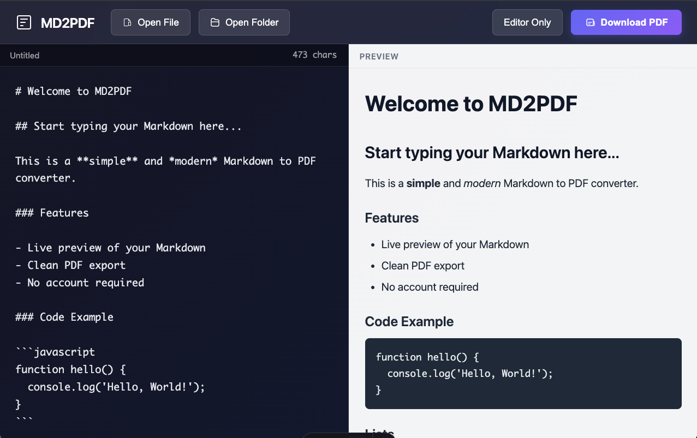

# MD2PDF

A clean, modern Markdown to PDF converter with live preview. Write your Markdown in the editor and instantly download it as a beautifully formatted PDF.



## Features

- **Live Preview** - See your rendered Markdown in real-time as you type
- **Split View** - Toggle between editor-only and split-view modes
- **Single File Mode** - Open individual Markdown files directly
- **Folder Mode** - Open entire folders and browse multiple Markdown files (sorted by most recent first). This is especially useful for spec-driven development — keep all your documentation in one place and easily navigate through specs, RFCs, or project docs. Your operating system may prompt for folder access permissions — this is just a browser security measure, and **no files are ever uploaded or leave your device**. Once granted, you can select any markdown file within that folder.
- **Clean PDF Export** - Generate professionally formatted PDFs with:
  - Proper typography and spacing
  - Syntax highlighting for code blocks
  - Table support
  - Image support
  - Customizable page margins
- **No Account Required** - Everything runs locally in your browser
- **Full GFM Support** - GitHub Flavored Markdown including tables, strikethrough, task lists, and more

## Getting Started

### Prerequisites

- Node.js 18+
- npm or yarn or pnpm

### Installation

```bash
# Clone the repository
git clone https://github.com/igordodic/md2pdf.git
cd md2pdf

# Install dependencies
npm install
```

### Development

```bash
# Start the development server
npm run dev
```

Open [http://localhost:4321](http://localhost:4321) in your browser.

### Build

```bash
# Build for production
npm run build

# Preview the production build
npm run preview
```

## Usage

1. **Start typing** - The editor comes with sample content to get you started
2. **Open a file** - Click "Open File" to load a single Markdown file
3. **Open a folder** - Click "Open Folder" to browse multiple Markdown files
4. **Toggle view** - Use "Split View" / "Editor Only" button to change layout
5. **Download PDF** - Click "Download PDF" to export your document

## Supported Markdown

- Headers (h1-h6)
- Bold and italic text
- Lists (ordered and unordered)
- Code blocks with syntax highlighting
- Inline code
- Blockquotes
- Links and images
- Tables (GFM)
- Task lists (GFM)
- Strikethrough (GFM)
- Horizontal rules

## Tech Stack

- **[Astro](https://astro.build)** - Web framework
- **[React](https://react.dev)** - UI library
- **[Marked](https://marked.js.org)** - Markdown parser
- **[Puppeteer](https://pptr.dev)** - PDF generation

## Project Structure

```
md2pdf/
├── public/
│   └── favicon.svg
├── src/
│   ├── components/
│   │   ├── MarkdownEditor.tsx
│   │   └── MarkdownEditor.css
│   └── pages/
│       ├── index.astro
│       └── api/
│           └── generate-pdf.ts
├── package.json
└── README.md
```

## Contributing

Contributions are welcome! Please feel free to submit a Pull Request.

1. Fork the repository
2. Create your feature branch (`git checkout -b feature/amazing-feature`)
3. Commit your changes (`git commit -m 'Add amazing feature'`)
4. Push to the branch (`git push origin feature/amazing-feature`)
5. Open a Pull Request

## License

MIT License - see [LICENSE](LICENSE) for details.

## Acknowledgments

- Built with [Astro](https://astro.build)
- Markdown parsing powered by [Marked](https://marked.js.org)
- PDF generation via [Puppeteer](https://pptr.dev)
